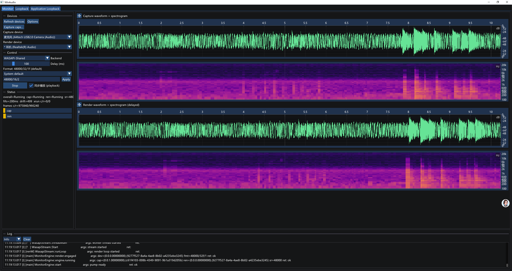
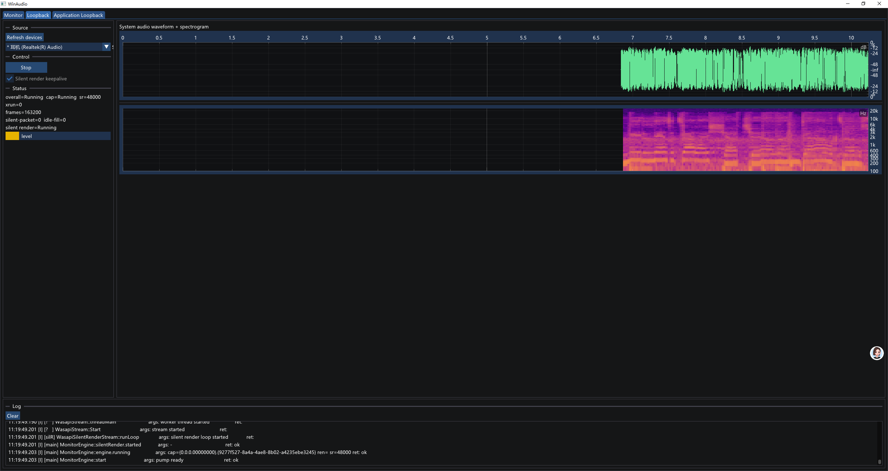
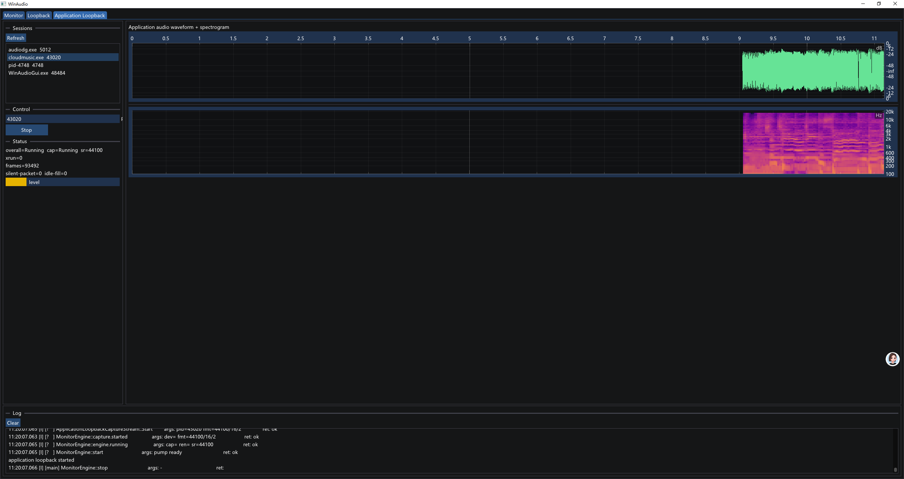

# GUI Screenshots

这些截图来自 WinAudio GUI 的真实运行状态，用于展示主要工作模式下的波形、声谱图、状态与日志区域。

## Monitor

双流延迟监听模式同时展示采集端与渲染端的波形和声谱图。

## Loopback

系统 loopback 模式回采当前 render endpoint 的系统输出。

## Application Loopback

Application Loopback 模式按 PID 捕获指定进程及其子进程树的音频。

